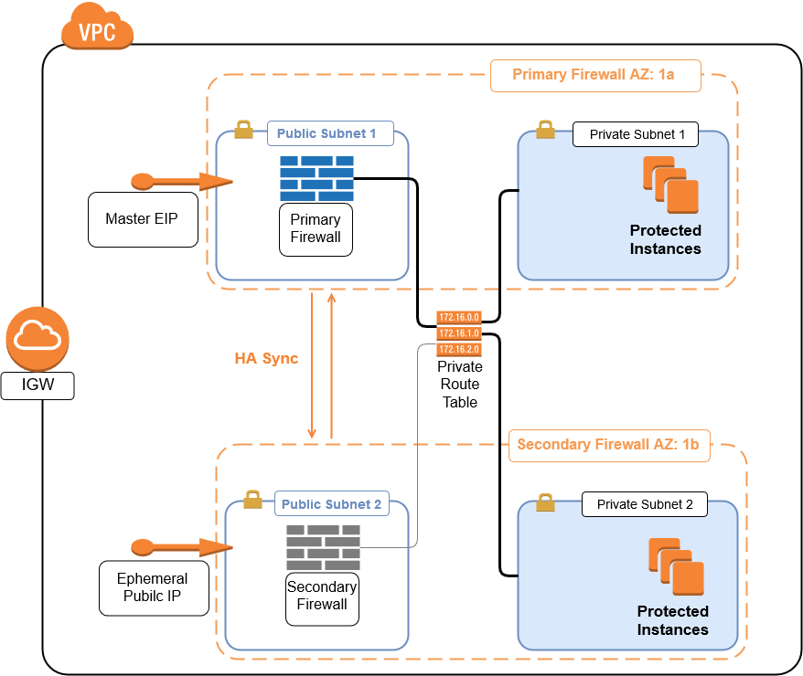
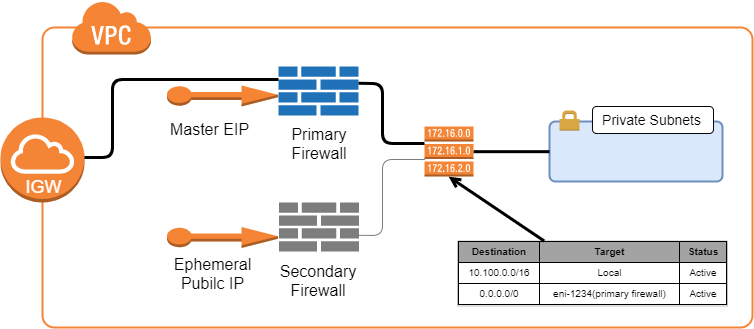

# Barracuda CloudGen Firewall for AWS - High Availability Cluster in Multiple Availability Zones with Elastic IP Shifting

## Introduction

To build highly available services in AWS, each layer of your architecture should be redundant over multiple Availability Zones. Each AWS region is made up of at least two isolated Availability Zones. In case one Availability Zone goes down, your application continues to run in the other datacenter without interruption with minimal failover time. 

For the Barracuda CloudGen Firewall (CGF), this means deploying two firewall instances into two public subnets, each in a different Availability Zone. The firewalls are in an active-passive cluster. Both firewalls share a virtual server containing such services as the Forwarding Firewall or VPN service. Should the primary firewall become unavailable, the virtual server is immediately started on the secondary firewall. The now-active secondary firewall connects to the underlying cloud platform and rewrites the routes in the AWS route table to use the now-active firewall as the gateway device for the backend instances. After the route table is rewritten, normal operations are resumed, even if one of the two Availability Zones is experiencing an outage. Failing over the virtual server, although fast, is not transparent to the user. Existing connections will time out, however, site-to-site VPNs generally re-connect within 30-60 seconds.

Elastic IP (EIP) shifting has some advantages over route shifting:
- No DNS or Route 53 configuration is required.
- No Elastic Load Balancer (ELB) is required.
- Legacy VPN endpoints that require hard-coded IP addresses can still take advantage of HA.

The following diagram illustrates a multi-AZ implementation of the Barracuda CloudGen Firewall in a High Availability pair:

High Availability Clusters must be sized for the expected peak load. If the expected workload is dynamic in nature and a default gateway is not required, use a CloudGen Firewall Auto Scaling cluster instead.

### Operation

EIP shifting works by reassigning the master EIP from the primary to the secondary firewall in the case of a failover. Any device that is programmed to communicate with the EIP will continue to function normally in case of a failover event. The failover takes place without any user intervention, however there will be a brief disruption in communications while the EIP is re-assigned to the secondary firewall and it begins processing traffic.

The following diagrams illustrate the HA pair in each state. During normal operation, the primary firewall is active while the secondary firewall is in stand-by mode:

When an HA failover event takes place, the secondary firewall comes into production. The elastic IP is associated with the secondary firewall to handle inbound traffic. For outbound traffic, the route table is modified so that the default route now uses the secondary firewall’s network interface:

The HA pair will remain in this state until the firewall administrator manually intervenes and puts the primary firewall back into production.

Use Cases for a CloudGen Firewall High Availability Cluster
- Site-to-Site VPN – One way on-premises to AWS, TINA, and IPsec site-to-site VPN tunnels.
- Edge Firewall – Scan for malicious traffic using the built-in IPS and handle access to resources via access rules.
- Secure Remote Access – Client-to-site VPN, CudaLaunch, and SSL VPN using TINA, SSL VPN, and IPsec VPN protocols.

## Prerequisites

The resources are deployed by means of a CloudFormation Template (CFT). This can be done from the AWS console or from a machine with AWS CLI installed. In either case, the user credentials will need to have sufficient rights to create all the elements described below under Deployed Resources. Additionally, you will need to create an IAM role for the CGF instances. Details on the IAM role can be found in this [Barracuda Campus article](https://campus.barracuda.com/doc/73719778/). You will also need to download the latest CFT files from the Barracuda [GitHub repository](https://github.com/barracudanetworks/cloud-reference-architectures). 

## Deployed Resources
The following resources are deployed into the region specified during the stack creation:
- A new VPC with an Internet Gateway
- Two public subnets in different availability zones
- A route table for the private subnets
- A route table for the public subnets
- Two CGF instances, one in each availability zone
- One elastic IP address

## Deployment
Deployment can be done from the AWS console or from a machine with AWS CLI installed. In either case you will need to clone or download the CFT files from the Barracuda [GitHub repository](https://github.com/barracudanetworks/cloud-reference-architectures).

### AWS Console
Open the AWS console and select the region where the firewalls will be deployed. Navigate to CloudFormation and select Create Stack. Under “Choose Template” select Upload a Template to Amazon S3. In the file select dialog browse to the location where you downloaded the files from the GitHub repository. Choose the file `CGF_HA_floatingEIP.json`. Click Next to move to “Specify Details.”
