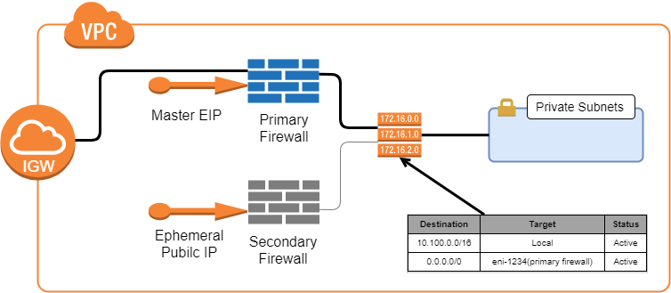

# Barracuda CloudGen Firewall for AWS - High Availability Cluster in Multiple Availability Zones with Elastic IP Shifting and Transit VPC

## Introduction

To build highly available services in AWS, each layer of your architecture should be redundant over multiple Availability Zones. Each AWS region is made up of at least two isolated Availability Zones. In case one Availability Zone goes down, your application continues to run in the other datacenter without interruption with minimal failover time. 

For the Barracuda CloudGen Firewall (CGF), this means deploying two firewall instances into two public subnets, each in a different Availability Zone. The firewalls are in an active-passive cluster. Both firewalls share a virtual server containing such services as the Forwarding Firewall or VPN service. Should the primary firewall become unavailable, the virtual server is immediately started on the secondary firewall. The now-active secondary firewall connects to the underlying cloud platform and rewrites the routes in the AWS route table to use the now-active firewall as the gateway device for the backend instances. After the route table is rewritten, normal operations are resumed, even if one of the two Availability Zones is experiencing an outage. Failing over the virtual server, although fast, is not transparent to the user. Existing connections will time out, however, site-to-site VPNs generally re-connect within 30-60 seconds.

Elastic IP (EIP) shifting has some advantages over route shifting:
- No DNS or Route 53 configuration is required.
- No Elastic Load Balancer (ELB) is required.
- Legacy VPN endpoints that require hard-coded IP addresses can still take advantage of HA.

The following diagram illustrates a multi-AZ implementation of the Barracuda CloudGen Firewall in a High Availability pair:

High Availability Clusters must be sized for the expected peak load. If the expected workload is dynamic in nature and a default gateway is not required, use a CloudGen Firewall Auto Scaling cluster instead.

### Operation

EIP shifting works by reassigning the master EIP from the primary to the secondary firewall in the case of a failover. Any device that is programmed to communicate with the EIP will continue to function normally in case of a failover event. The failover takes place without any user intervention, however there will be a brief disruption in communications while the EIP is re-assigned to the secondary firewall and it begins processing traffic.

The following diagrams illustrate the HA pair in each state. During normal operation, the primary firewall is active while the secondary firewall is in stand-by mode:

When an HA failover event takes place, the secondary firewall comes into production. The elastic IP is associated with the secondary firewall to handle inbound traffic. For outbound traffic, the route table is modified so that the default route now uses the secondary firewall’s network interface:

The HA pair will remain in this state until the firewall administrator manually intervenes and puts the primary firewall back into production.

Use Cases for a CloudGen Firewall High Availability Cluster
- Site-to-Site VPN – One way on-premises to AWS, TINA, and IPsec site-to-site VPN tunnels.
- Edge Firewall – Scan for malicious traffic using the built-in IPS and handle access to resources via access rules.
- Secure Remote Access – Client-to-site VPN, CudaLaunch, and SSL VPN using TINA, SSL VPN, and IPsec VPN protocols.

## Prerequisites

The resources are deployed by means of a CloudFormation Template (CFT). This can be done from the AWS console or from a machine with AWS CLI installed. In either case, the user credentials will need to have sufficient rights to create all the elements described below under Deployed Resources. Additionally, you will need to create an IAM role for the CGF instances. Details on the IAM role can be found in this [Barracuda Campus article](https://campus.barracuda.com/doc/73719778/). You will also need to download the latest CFT files from the Barracuda [GitHub repository](https://github.com/barracudanetworks/cloud-reference-architectures). 

## Deployed Resources
The following resources are deployed into the region specified during the stack creation:
- A new VPC with an Internet Gateway (hub VPC)
- Two public subnets in different availability zones
- Two spoke VPCs, each with a private subnet
- A route table for the hub private subnets
- A route table for the hub public subnets
- A route table for each spoke VPC's subnets
- Four customer gateways- CGF1 spoke 1,2 and CGF2 spoke 1,2
- Four site-to-site VPNs- CGF1 to spoke1, spoke2 and CGF2 to spoke 1, spoke 2
- Two virtual private gateways, one for each spoke VPC
- Two CGF instances, one in each availability zone
- One elastic IP address

## Deployment
Deployment can be done from the AWS console or from a machine with AWS CLI installed. In either case you will need to clone or download the CFT files from the Barracuda [GitHub repository](https://github.com/barracudanetworks/cloud-reference-architectures).

### AWS Console
Open the AWS console and select the region where the firewalls will be deployed. Navigate to CloudFormation and select Create Stack. Under “Choose Template” select Upload a Template to Amazon S3. In the file select dialog browse to the location where you downloaded the files from the GitHub repository. Choose the file `CGF_HA_floatingEIP.json`. Click Next to move to “Specify Details.”

The following information will need to be supplied:
-	Stack Name
-	Instance Type
-	License Mode – BYOL, PAYG, or metered
-	Release Version (8.0.0 recommended)
-	VPC address space (recommend at least a /20 network)
-	Private IP address for each firewall
-	AZ for primary firewall
-	AZ for secondary firewall
-	Enable RESTAPI by default
-	IAM profile name (the IAM you created earlier)
-	Prefix prepended to all resources created by this template

After specifying the details, click Next to proceed to Options. These include:
-	Tags
-	Permissions – specify IAM role used by CFT when creating resources
-	Rollback triggers
-	Advanced options like notifications and stack policy

After specifying the options, click Next to proceed to the Review page. Review your selections, and then click Create to deploy the stack. Stack creation can take 10 minutes or more to complete.

## Next Steps

After the deployment has completed you can log in to the primary firewall using the Barracuda Firewall Admin utility. (Download [here](https://d.barracudanetworks.com/ngfirewall/8.0.0/FirewallAdmin_8.0.0-819.exe).) This is a self-contained Windows binary that does not require installation. Detailed information about the Firewall Admin utility can be found in this Barracuda [Campus article](https://campus.barracuda.com/product/cloudgenfirewall/doc/73719519/barracuda-firewall-admin/).

Launch Firewall Admin and connect to the EIP address that was deployed by the template. Note that both the primary and secondary firewalls will have a public IP address, however only the primary firewall will have the EIP address. Connect to the firewall with username of “root” and the instance ID as the initial password.

The first time you log in you will be asked to trust the certificate. Click Trust, and then click Yes to change the root password. You will be prompted to log in again with the new password. Once logged in you will be at the dashboard.

For BYOL deployments you will also need to activate the license as described in this Barracuda [Campus article](https://campus.barracuda.com/product/cloudgenfirewall/doc/79463377/how-to-activate-and-license-a-stand-alone-virtual-or-public-cloud-firewall-or-control-center). Note: it is sometimes convenient to deploy a Windows bastion host in one of the public subnets. You can RDP into the bastion host and run the Firewall Admin utility there. This is especially helpful if you are testing HA failover scenarios. See this AWS [Security Blog article](https://aws.amazon.com/blogs/security/controlling-network-access-to-ec2-instances-using-a-bastion-server/) for tips on creating a secured bastion host.

To test the firewall it is necessary to have at least one host in a private subnet. In the AWS console navigate to VPC and select Subnets. Create a new subnet within the newly deployed VPC. After the subnet is created, navigate to Route Tables. You will see several route tables listed. Select the private route table created by the template. Select the Subnet Association tab, click Edit, and then select the private subnet that you just created. You may now deploy hosts in the private subnet and they will be protected by the CGF. When deploying hosts into the private subnet be sure to disable auto-assignment of public IP address.

At this point the firewalls have been deployed and are ready to be configured. 

## Post Deployment Configuration

After logging in you will be at the system dashboard. All firewall configuration tasks are done from the CONFIGURATION tab. Click CONFIGURATION and note the Configuration Tree. Start by navigating to the firewall forwarding rules: Configuration Tree > Virtual Servers > S1 > Assigned Services > NGFW (Firewall) and double-click Forwarding Rules. The default forwarding rules are displayed:

Several rules have automatically been created. For example, rule #7 (CLOUD-NET-2-INTERNET) is a pass rule allowing traffic from VPC hosts to connect to the Internet.

The CGF can also protect inbound connections. As an example we will create a destination NAT rule that allows incoming traffic on port 221 to be directed to a Linux server in a protected subnet. Start by clicking Lock, then click the small green + icon that appears directly below the Send Changes button. A new rule dialog will be displayed. Make the follow edits to the new rule:
-	Click the drop-down and change Block to Dst-NAT
-	Change the rule name from NewRule to SSH-221
-	Under Source, click the drop-down and select Internet
-	Under Service, click the drop-down and select <explicit-srv>
- - Double-click in the grid under <explicit-srv> to open the edit/create service object dialog
- - Click New Object (second dialog opens)
- - Put “221” in the Port Range field and click OK then click OK again
-	Under Destination, click the drop-down and select All Firewall IPs
-	In the Target List field put the IP address of the host in IP:port format
-	Under Connection Method click the drop-down and select Original Source IP
-	Click OK to add the rule
The new rule will look similar to this:

The new rule is inserted into the list at #11 and BLOCKALL becomes rule #12. Click Send Changes, Activate, and Activate to apply the rule. The firewall will now accept SSH connections on port 221 and redirect them to the specified host. In the above example the connections would go to 10.222.11.132. This method can be employed for inbound connections using any TCP protocol, such as RDP, HTTP, and HTTPS.

More information on configuring the Barracuda CloudGen Firewall can be found at [Barracuda Campus](https://campus.barracuda.com/product/cloudgenfirewall/doc/79462645/overview/). 
