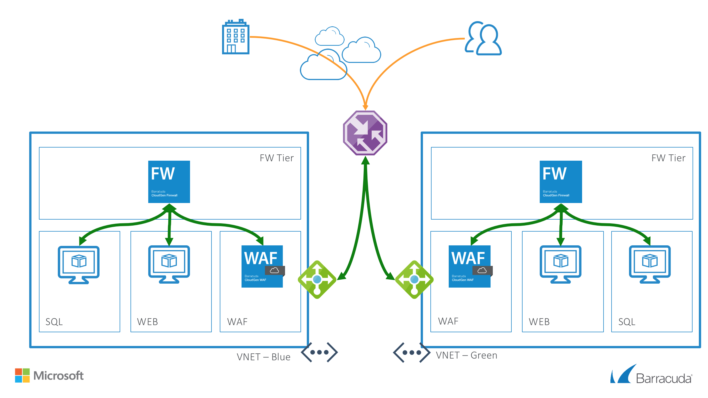
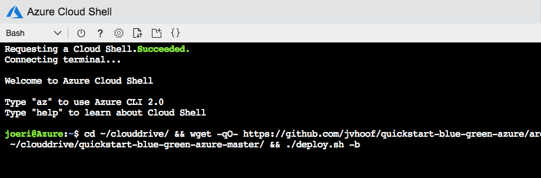

# Barracuda CloudGen Firewall and Web Application Firewall in Azure - Blue / Green Deployment (Zero Downtime Deployment Release)

## Introduction

### Purpose of this Architecture
Organizations rely on the "blue-green" architecture when they want an infrastructure that will allow them to test and deploy new applications, builds, updates, etc., with zero downtime, by leveraging identical application stacks.  

This reference architecture, known as blue-green, utilizes two identical application stacks - one is always live, and one is always standby.  Because this is deployed in Azure, it is essentially infrastructure-as-code.

When a new build is deployed (new application, new updates, etc.); it is deployed on the standby stack to allow for thorough testing.  Once it is determined the new build is satisfactory, users are typically added in groups, to ensure that no new issues are encountered, and at some point, all users are added to that stack and the previously-production stack becomes standby.

### Benefits

- Zero downtime for deployed pipeline
- Deployment-via-code reduces the opportunities for huyman error to occur
- Blue/Green allows you to test yournew deployment before it is made life
- No downtime when switching to a new version
- You can always revert to the previous version in case of issues with the new version

### Operation

This architecture leverages Azure as well as the Barracuda CloudGen Firewall and CloudGen WAF. The Barracuda CloudGen Fiorewall will provide you a single console through which to view and manage traffic passint through the environment, improving troubleshooting and visibility.  The CloudGen WAF will ensure all inbound web traffic and the responses are inspected for data leakage, viruses, OWASP-Top-10 attacks, web scraping and other threats, to both the application and to your users.

In the below diagram, a blue/green stack ahs been implemented containing database servers, web servbers as well as the security components of CloudGen WAF and CloudGen Firewall to provide security on the access into the Web Application and the environment.

In a Blue/Green design two environments are used to manage the implementation of new software releases or components while maintaining high availability of the services in that environment.  You can esily move users from one environment to another as necessary to complete the release with minimal interruption (i.e., zero downtime).  This architecture can also be leveraged in the scenario where you want to rehydrate your environment to ensure it is clean.

## Prerequisites
The tools used in this setup are HashiCorp Terraform (> 0.11.x) and RedHat Ansible (> 2.x). Both tools have their pro's and con's. Working together they help maintaining the state of your infrastructure and the ensures the configuration is correct. The deployment can be done from either a bash shell script or from any CI tool. In our case we used Visual Studio Team Services (VSTS). The LINUX VSTS agent requires the Ansible and Terraform tools to be installed as well as the VSTS agent.

## Deployed resources
Following resources will be created by this deployment per color:
- One virtual network with CGF, WAF, WEB and SQL subnets
- Routing for the WEB and SQL subnets
- One CGF virtual machine with a network interface and public IP in a Availability Set
- One WAF virtual machine with a network interface and public IP in a Availability Set
- One WEB Linux virtual machine with a network interface
- One SQL Linux virtual machine with a network interface
- Two external Azure Basic Load Balancer, containing either the CGF or WAF virtual machines with a public IP and services for HTTP, HTTPS IPSEC and/or TINA VPN tunnels
- Azure Traffic Manager to switch from Blue to Green deployment and back

## Deployment

Deployment of this environment is possible via the Azure Cloud Shell. It is also possible via the a system that has Terraform and Ansible installed like a docker image (jvhoof/cloudgen-essentials). However for this deployment you will need to pass the credentials for Azure via the command line or environment variables. This is done automatically in Azure Cloud Shell. 

You can also integrate the deployment of the Blue or Green environments into Azure DevOps or another CI/CD tools. 

The package provides a deploy.sh and destroy.sh scripts which will build or remove the whole setup per color when the correct arguments are supplied as well as the correct environment variables are set. For Azure DevOps the yaml files are provided.

### Azure CLI

To deploy via Azure Cloud Shell you can connect via the Azure Portal or directly to [https://shell.azure.com/](https://shell.azure.com/). 

- Start up Azure Cloud Shell from the Azure Portal or go directly to [https://shell.azure.com](https://shell.azure.com/)
- Download the latest version of the Quickstart templates in the persistant clouddrive and run the deployment script:

    - blue: `cd ~/clouddrive/ && wget -qO- https://github.com/barracudanetworks/cloud-reference-architectures/archive/master.zip | jar x && cd ~/clouddrive/cloud-reference-architectures-master/Quickstart-Azure-Blue-Green/ && ./deploy.sh -b`
    - green: `cd ~/clouddrive/ && wget -qO- https://github.com/barracudanetworks/cloud-reference-architectures.git | jar x && cd ~/clouddrive/cloud-reference-architectures-master/Quickstart-Azure-Blue-Green/ && ./deploy.sh -g`

- Answer the questions asked by the script on the following variables: location, prefix and password.

### deploy.sh and destroy.sh Parameters
The script requires certain environment variables as well as some arguments. 

| Argument | Deploy | Destroy | Parameter Name | Description
|---|---|---|---|---
-b | X | X | DEPLOYMENTCOLOR BLUE | Which version do you want to deploy... blue
-g | X | X | DEPLOYMENTCOLOR GREEN | Which version do you want to deploy... green

## Post Deployment Configuration

This deployment creates a CloudGen WAF and CloudGen Firewall. You can once deployed access the demo application by going to the public IP of the WAF using HTTPS.

To manage the CloudGen WAF you can access the management console via a webbrowser on HTTP port 8000 or HTTPS port 8443. More information can be found [here](https://campus.barracuda.com/product/webapplicationfirewall/doc/4259901/getting-started/).

To maange the CloudGen Firewall you can manage it via the Firewall Admin aplication. More information to get started can be found [here](https://campus.barracuda.com/product/cloudgenfirewall/doc/73718955/getting-started/).

It is also recommended you harden management access by enabling multifactor or key authentication and by restricting access to management interface using Management ACL: [How to Change the Root Password and Management ACL](https://campus.barracuda.com/product/nextgenfirewallf/article/NGF71/ChangeRootPWandMgmtACL/)

## Template Parameters

| Variable Name | Description
|---|---
TF_VAR_LOCATION | Azure datacenter location to deploy the environment
TF_VAR_PREFIX | Prefix text for all deployed resources
TF_VAR_TMDNSNAME | Azure Traffic Manager DNS name
DOWNLOADSECUREFILE1_SECUREFILEPATH | The location of the SSH private key used to connect to the backend servers

