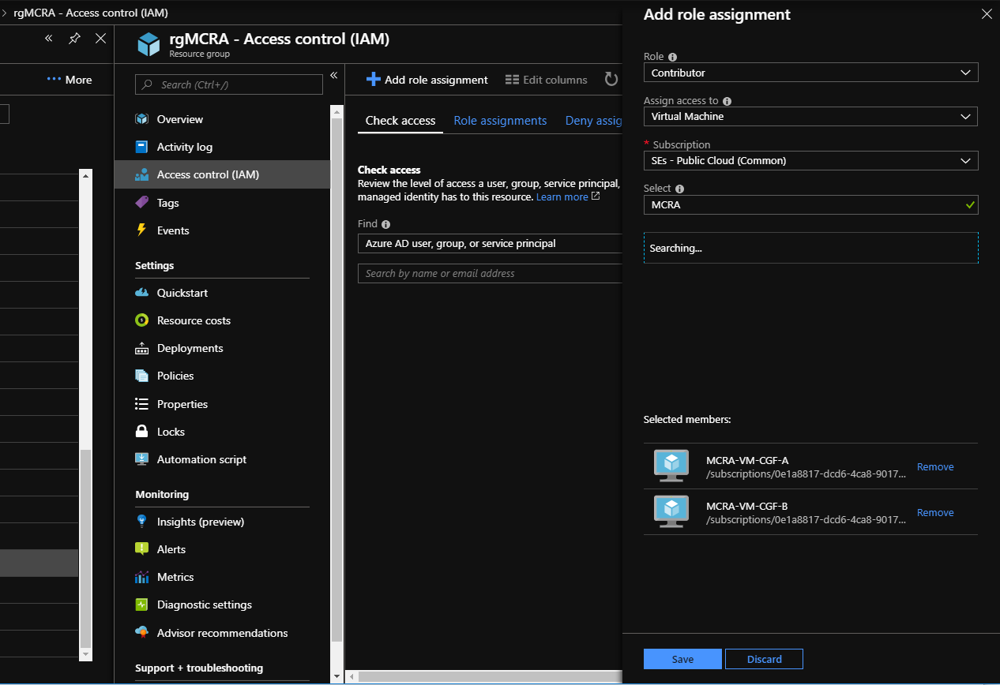
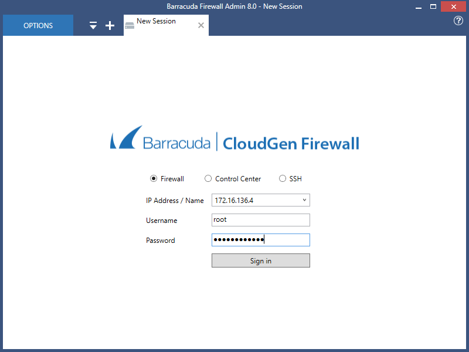
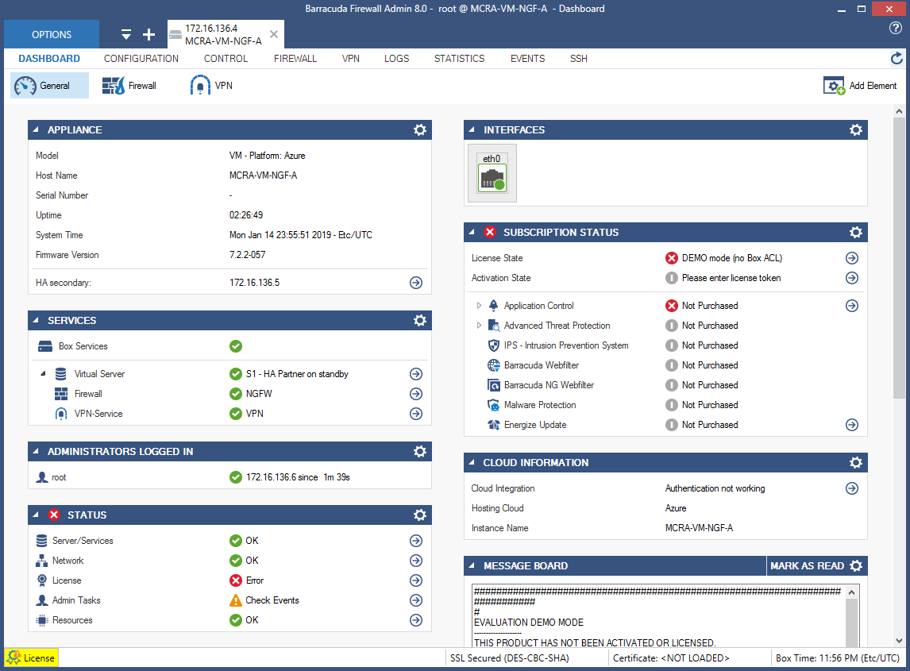
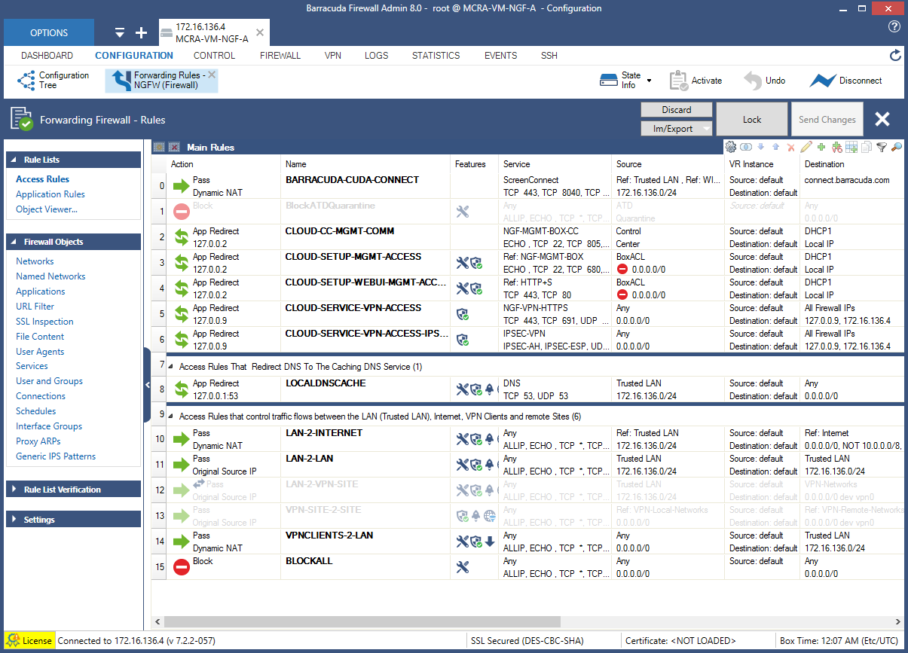
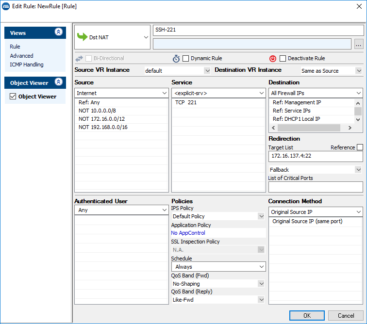
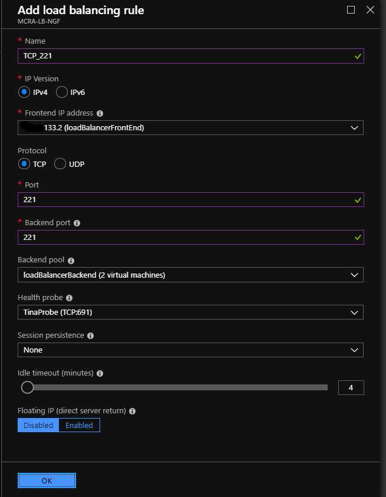

# Barracuda CloudGen Firewall F Series for Azure - High Availability Cluster with Cloud Integration

## Introduction
To best take advantage of the power and flexibility of the Azure cloud it is important to deploy firewall devices in a highly available (HA) pair using an availability set. In cases where the standard load balancer with HA ports is not feasible the traditional HA configuration using Barracuda's Cloud Integration can be employed.

This Azure Resource Manager (ARM) template will deploy a cluster of Barracuda CloudGen Firewall virtual machines in a new virtual network (VNET). Deployment is done in a one-armed fashion where north-south (traffic entering and leaving the VNET), east-west (traffic between hosts within the VNET), and VPN tunnel traffic can be intercepted and inspected based on User Defined Routing (UDR). UDR is applied on a per-subnet basis. Additionally, this template will deploy an Azure Load Balancer with an external IP address to direct the traffic to the active unit in the cluster. Note that the CGF VM's are deployed in their own subnet with no other resources. All protected subnets will be associated with a route table that points to the active CGF as the next hop IP address. Do not put the firewall subnet in a route table as this will cause routing loops.

To adapt this deployment to your requirements you can modify the azuredeploy.paramters.json file and/or the deployment script in Powershell or Azure CLI (Bash).

## Prerequisites
The solution does a check of the template when you use the provided scripts. It does require that [Programmatic Deployment](https://azure.microsoft.com/en-us/blog/working-with-marketplace-images-on-azure-resource-manager/) is enabled for the Barracuda Next Gen Firewall F BYOL or PAYG images. Barracuda recommends use of **D**, **D_v2**, **F** or newer series. 

## Deployment

The package provides a deploy.ps1 and deploy.sh for Powershell or Azure CLI based deployments. This can be peformed from the Azure Portal as well as the any system that has either of these scripting infrastructures installed. Or you can deploy from the Azure Portal using the provided link.

## Deployed resources
Following resources will be created by the template:
- One Azure VNET with 3 subnets (1 for the CGF, additional subnets for a red and green subnet)
- Two route tables that will route all traffic for external and towards the other internal networks to the Barracuda CGF
- One external Basic Azure Load Balancer containing the deployed virtual machines with a public IP and services for IPSEC and TINA VPN tunnels available
- Two Barracuda CloudGen Firewall F virtual machines with 1 network interface each and public IP
- Both CGF systems are deployed in an Availability Set

**Note** Other than the read and green subnets, the backend subnets and resources are not automatically created by the template. This has to be done manually after template deployment has finished.

## During Deployment
Deployment can take 10-15 minutes to complete, however there are a few things that can be done during this time. In the Azure portal navigate to the resource group and click the refresh button every few seconds until you see that the virtual network and the two virtual machines appear in the list of resources.

In the resource group view, click Access Control (IAM) > Add Role Assignment, then select the following:
* Role: Contributor
* Assign access to: Virtual Machine
* Subscription: the subscription containing the CGF virtual machines
* Select: choose the two CGF machines being deployed

The settings will look similar to the following image:

Click Save.

Navigate in the portal to each of the CGF virtual machines and make and note of the public IP addresses. You will need these for the firewall administration connection. Also navigate to the externally facing load balancer and make a note of the front-end IP address. This is the IP address to which clients will connect. It is also the target for any DNS A records that need to connect to resources behind the firewall cluster.

Optionally you may wish to launch a Windows Server instance in the CGF subnet to serve as a bastion host.

## Next Steps

After the deployment has completed you can log in to the primary firewall using the Barracuda Firewall Admin utility. (Download [here](https://d.barracudanetworks.com/ngfirewall/8.0.0/FirewallAdmin_8.0.0-819.exe).) This is a self-contained Windows binary that does not require installation. Detailed information about the Firewall Admin utility can be found in this Barracuda [Campus article](https://campus.barracuda.com/product/cloudgenfirewall/doc/73719519/barracuda-firewall-admin/).

Launch Firewall Admin and connect to the public IP address of the primary firewall. (You may also employ a Windows jump host deployed into the same VNET and subnet as the two CGF virtual machines.) Connect to the firewall with username of “root” and the password you specified in the template.

The first time you log in you will be asked to trust the certificate. Click Trust, and then will be at the dashboard.

For BYOL deployments you will also need to activate the license as described in this Barracuda [Campus article](https://campus.barracuda.com/product/cloudgenfirewall/doc/79463377/how-to-activate-and-license-a-stand-alone-virtual-or-public-cloud-firewall-or-control-center). Note: as mentioned above, it is sometimes convenient to deploy a Windows bastion host in the firewall subnet. You can RDP into the bastion host and run the Firewall Admin utility there. This is especially helpful if you are testing HA failover scenarios.

To test the firewall it is necessary to have at least one host in a private subnet. In the Azure portal deploy a Windows or Linux machine in the red or green subnet. (You may even wish to deploy a host in each subnet to test east-west traffic flowing through the firewall.) Make sure that the host you deploy does not have a public IP address and that it does not have an NSG assigned. (It is possible to have an NSG, however in this scenario that would cause unnecessary redundancy since the CGF can perform all the functions of an NSG and more.)

At this point the firewalls have been deployed and are ready to be configured. 

## Post Deployment Configuration

After logging in you will be at the system dashboard. All firewall configuration tasks are done from the CONFIGURATION tab. Click CONFIGURATION and note the Configuration Tree. Start by navigating to the firewall forwarding rules: Configuration Tree > Virtual Servers > S1 > Assigned Services > NGFW (Firewall) and double-click Forwarding Rules. The default forwarding rules are displayed:

Several rules have automatically been created. For example, rule #7 (CLOUD-NET-2-INTERNET) is a pass rule allowing traffic from VPC hosts to connect to the Internet.

The CGF can also protect inbound connections. As an example we will create a destination NAT rule that allows incoming traffic on port 221 to be directed to a Linux server in a protected subnet. Start by clicking Lock, then click the small green + icon that appears directly below the Send Changes button. A new rule dialog will be displayed. Make the follow edits to the new rule:
-	Click the drop-down and change Block to Dst-NAT
-	Change the rule name from NewRule to SSH-221
-	Under Source, click the drop-down and select Internet
-	Under Service, click the drop-down and select 'explicit-srv'
- - Double-click in the grid under <explicit-srv> to open the edit/create service object dialog
- - Click New Object (second dialog opens)
- - Put “221” in the Port Range field and click OK then click OK again
-	Under Destination, click the drop-down and select All Firewall IPs
-	In the Target List field put the IP address of the host in IP:port format
-	Under Connection Method click the drop-down and select Original Source IP
-	Click OK to add the rule
The new rule will look similar to this:

The new rule is inserted into the list at #11 and BLOCKALL becomes rule #12. Click Send Changes, Activate, and Activate to apply the rule. 

Lastly, you will need to allow connections on TCP port 221 to come through the load balancer. In the Azure portal, select the load balancer, then select Load Balancing Rules and then click +Add. Create a new load balancing rule for port 221. The new rule will appear similar to this:

The firewall will now accept SSH connections on port 221 and redirect them to the specified host. In the above example the connections would go to 172.16.137.4. This method can be employed for inbound connections using any TCP protocol, such as RDP, HTTP, and HTTPS.

More information on configuring the Barracuda CloudGen Firewall can be found at [Barracuda Campus](https://campus.barracuda.com/product/cloudgenfirewall/doc/79462645/overview/). 

## Post Deployment Configuration

Visit our [campus website](https://campus.barracuda.com/product/cloudgenfirewall/doc/73718958/implementation-guide-cloudgen-firewall-in-azure/) for more in-depth information on deployment and management.

It is also recommended you harden management access by enabling multifactor or key authentication and by restricting access to management interface using Management ACL: [How to Change the Root Password and Management ACL](https://campus.barracuda.com/product/cloudgenfirewall/doc/79463301/how-to-change-the-root-password-and-management-acl/)

## Template Parameters
| Parameter Name | Description
|---|---
adminPassword | Password for the Next Gen Admin tool 
prefix | identifying prefix for all VM's being build. e.g WeProd would become WeProd-VM-CGF (Max 19 char, no spaces, [A-Za-z0-9]
vNetAddressSpace | Network range of the VNET (e.g. 172.16.136.0/22)
subnetCGF | Network range of the subnet containing the CloudGen Firewall (e.g. 172.16.136.0/24)
subnetRed | Network range of the red subnet (e.g. 172.16.137.0/24)
subnetGreen | Network range of the green subnet (e.g. 172.16.138.0/24)
imageSKU | SKU Hourly (PAYG) or BYOL (Bring your own license)
vmSize | Size of the VMs to be created
ccManaged | Is this instance managed via a Next Gen Control Center (Yes/No)
ccClusterName | The name of the cluster of this instance in the Next Gen Control Center
ccRangeId | The range location of this instance in the Next Gen Control Center
ccIpAddress | IP address of the Next Gen Control Center
ccSecret | Secret to retrieve the configuration from the Next Gen Control Center
