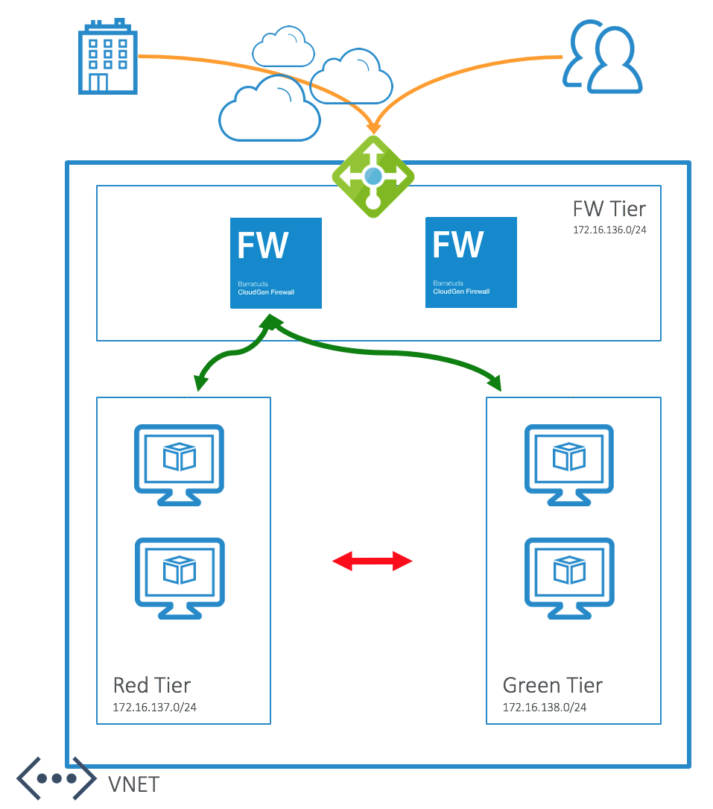

# Barracuda CloudGen Firewall F Series for Azure - High Availability Cluster with Cloud Integration

## Introduction
To best take advantage of the power and flexibility of the Azure cloud it is important to deploy firewall devices in a highly available (HA) pair using an availability set. In cases where the standard load balancer with HA ports is not feasible the traditional HA configuration using Barracuda's Cloud Integration can be employed.

This Azure Resource Manager (ARM) template will deploy a cluster of Barracuda CloudGen Firewall virtual machines in a new virtual network (VNET). Deployment is done in a one-armed fashion where north-south (traffic entering and leaving the VNET), east-west (traffic between hosts within the VNET), and VPN tunnel traffic can be intercepted and inspected based on User Defined Routing (UDR). UDR is applied on a per-subnet basis. Additionally, this template will deploy an Azure Load Balancer with an external IP address to direct the traffic to the active unit in the cluster. Note that the CGF VM's are deployed in their own subnet with no other resources. All protected subnets will be associated with a route table that points to the active CGF as the next hop IP address. Do not put the firewall subnet in a route table as this will cause routing loops.

To adapt this deployment to your requirements you can modify the azuredeploy.paramters.json file and/or the deployment script in Powershell or Azure CLI (Bash).

## Prerequisites
The solution does a check of the template when you use the provided scripts. It does require that [Programmatic Deployment](https://azure.microsoft.com/en-us/blog/working-with-marketplace-images-on-azure-resource-manager/) is enabled for the Barracuda Next Gen Firewall F BYOL or PAYG images. Barracuda recommends use of **D**, **D_v2**, **F** or newer series. 

## Deployment

The package provides a deploy.ps1 and deploy.sh for Powershell or Azure CLI based deployments. This can be peformed from the Azure Portal as well as the any system that has either of these scripting infrastructures installed. Or you can deploy from the Azure Portal using the provided link.

## Deployed resources
Following resources will be created by the template:
- One Azure VNET with 3 subnets (1 for the CGF, additional subnets for a red and green subnet)
- Two route tables that will route all traffic for external and towards the other internal networks to the Barracuda CGF
- One external Basic Azure Load Balancer containing the deployed virtual machines with a public IP and services for IPSEC and TINA VPN tunnels available
- Two Barracuda CloudGen Firewall F virtual machines with 1 network interface each and public IP
- Both CGF systems are deployed in an Availability Set

**Note** Other than the read and green subnets, the backend subnets and resources are not automatically created by the template. This has to be done manually after template deployment has finished.

## Next Steps

After successful deployment you can manage them using [CloudGen Firewall Admin](https://d.barracudanetworks.com/ngfirewall/8.0.0/FirewallAdmin_8.0.0-819.exe) application. The Firewall Admin application, as well as other related resources, is also available from the [Barracuda Download Portal](https://login.barracudanetworks.com/auth/login/). Connect to each firewall instance separately using the public IP address found in the VM properties. The initial username is *root* and the password is what you provided during template deployment. 

## Post Deployment Configuration

Visit our [campus website](https://campus.barracuda.com/product/cloudgenfirewall/doc/73718958/implementation-guide-cloudgen-firewall-in-azure/) for more in-depth information on deployment and management.

It is also recommended you harden management access by enabling multifactor or key authentication and by restricting access to management interface using Management ACL: [How to Change the Root Password and Management ACL](https://campus.barracuda.com/product/cloudgenfirewall/doc/79463301/how-to-change-the-root-password-and-management-acl/)

## Template Parameters
| Parameter Name | Description
|---|---
adminPassword | Password for the Next Gen Admin tool 
prefix | identifying prefix for all VM's being build. e.g WeProd would become WeProd-VM-CGF (Max 19 char, no spaces, [A-Za-z0-9]
vNetAddressSpace | Network range of the VNET (e.g. 172.16.136.0/22)
subnetCGF | Network range of the subnet containing the CloudGen Firewall (e.g. 172.16.136.0/24)
subnetRed | Network range of the red subnet (e.g. 172.16.137.0/24)
subnetGreen | Network range of the green subnet (e.g. 172.16.138.0/24)
imageSKU | SKU Hourly (PAYG) or BYOL (Bring your own license)
vmSize | Size of the VMs to be created
ccManaged | Is this instance managed via a Next Gen Control Center (Yes/No)
ccClusterName | The name of the cluster of this instance in the Next Gen Control Center
ccRangeId | The range location of this instance in the Next Gen Control Center
ccIpAddress | IP address of the Next Gen Control Center
ccSecret | Secret to retrieve the configuration from the Next Gen Control Center
